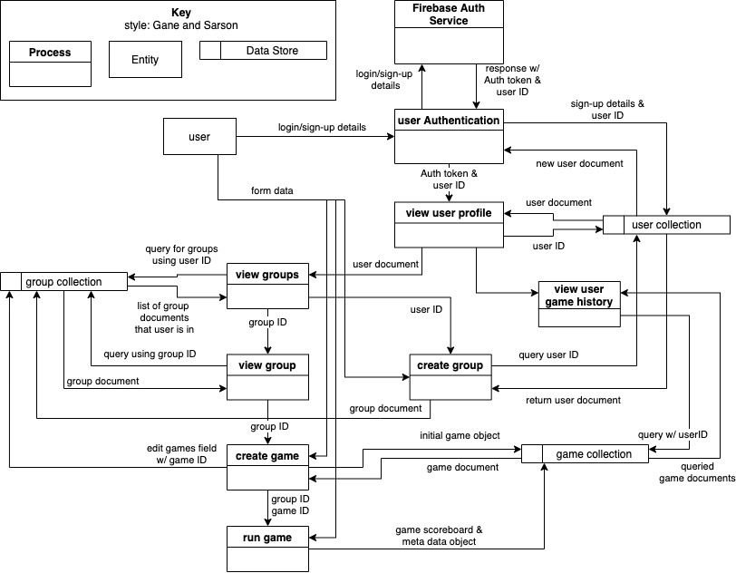
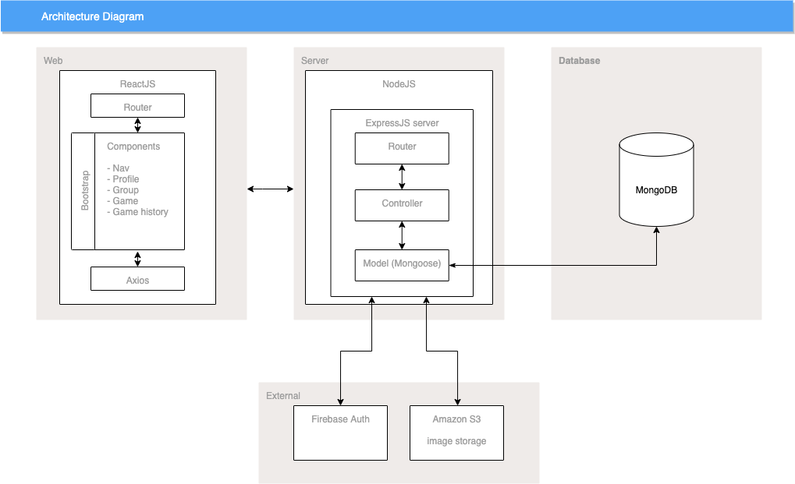
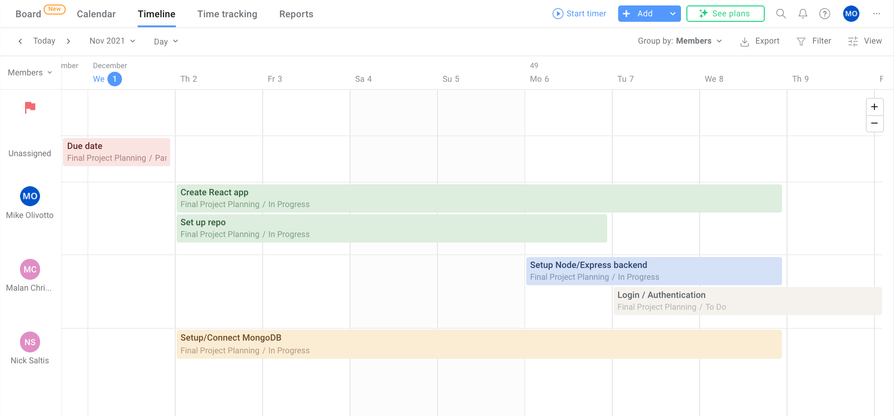

# T3A2 - Final Assignment (Part A)

​	Malan Christensen
​	Mike Olivotto
​	Nick Saltis

## R1 - Description of Website

### Client

 “Games King”, a games store specialising in board and group games of all kinds.

### Purpose

The client is looking for ways to foster a community of gamers and encourage them to stay engaged with the business. He is looking for a solution that will be primarily used by his customers and for which he can remain relatively hands off.

The store’s customers are social board game players who attend regular game meetings and need a convenient way to keep score during gameplay, as well as keep track of historical data related to wins/losses and other related data.

While score-keeping apps already exist in many forms, most only come with basic functionality such as [keeping score for a single game](https://keepthescore.co/s/hioiunyleje/), [only providing 1-point increments](https://scorecount.com/), designed to [only work for one specific game](https://keepthescore.co/basketball-scoreboard/), or even [require a download to use](https://itunes.apple.com/app/id463243024).

This app intends to take the concept of a score keeping app several steps further, tying it in with the business’ desire to build and foster a community of gamers who will continue to visit the store, can compete in competitions and keep track of historic performance. 

### Functionality / Features

Based on the client’s needs and the user stories developed (see further down), the following set of features have been identified as integral to the MVP:

- Authentication
  - Log in as a specific user and and apply user roles
- Create groups of players
  - A user creating a group becomes the game admin/scorekeeper
  - The admin can invite other users, who accept or reject that invitation
  - Create instances of games within a group
- Scorekeeping games
- Tracking historical results for groups and individual users 

Additional non-essential features have been identified as ‘nice-to-have’ functionality upon completion of the MVP, time permitting:

- Real time multi-user score keeping (ie. each user can see the score as it is updated, without the need to manually check for updates)
- Customisable and saveable game templates
  - Add time constraints to a given game (time keeping)
  - Allow multiple rounds/sets in a single game
  - Custom score counters (arbitrarily set score increment options)
- Create events for tracking multiple games and overall results (eg. for use in tournaments)

### Target audience

The app is targeted at Games King’s customers, players of group games where wins and losses are assessed on earned scores. The store’s customers are between 16 and 35 years of age, digital natives who are comfortable with managing all aspects of their lives via their mobile devices, and as such tend to only carry their mobile phones on them when visiting the store.

#### Personas

The following personas have been developed to provide general insight into the app’s target audience and stakeholders, and to assist in creating user stories that clearly articulate the needs and wants of these people the app will be designed for.

##### Hillary - Games organiser/player

- Super organised
- Social butterfly, she’s a ‘connector’ of people
- Likes to take control
- Frequently organises social games nights with her friends

##### James - Board game player

- Avid board game player, likes to mix it up with a variety of games
- Is focused on his own performance in the game, happy to let someone else keep tabs on time and other players’ scores
- Very competitive and likes to know how he compares to other players
- Stats nerd, likes to analyse his performance

##### Blake - Games store owner

- Owns a games store

- Busy running his business, convenience is his priority

- Wants to be hands off

  

#### Tech Stack

##### Front end

- ReactJS - Javascript library for creation of components
- Bootstrap - CSS framework

##### Back End

- Express - Server
- NodeJS - for Express to run on top of
- MongoDB - nosql database

##### External

- Firebase authentication
- Heroku - app deployment
- S3 - hosting user uploads

## R2 - Data Flow diagram

## R3 - Application Architecture Diagram

## R4 - User Stories

User stories are grouped based on the features that we aim to implement to achieve our MVP for this project and additional features that we would like to implement once the foundation of the app is in place. 

Our initial user stories used basic personas that had only one trait. Our revisions incorporated the personas that we identified as being our target audience into the user stories to better envisage how our users would want to interact with the app.

#### MVP:

* Authentication - log in as a user and/or platform/game admin

  | Version | Story                                                        |
  | ------- | ------------------------------------------------------------ |
  | Ver. 1  | I participate in lots of activities, I want to be able to securely log in so that my score and progress history is not manipulated by anyone else. |
  | Ver. 2  | I am James, a board game player. I want to be able to securely log in to the app and have my own profile that records the results of games I have participated in so that my player stats are retained and are not changed by other people accessing my profile. |

  | Version | Story                                                        |
  | ------- | ------------------------------------------------------------ |
  | Ver. 1  | I am running a game night, I want it to be easy to login so that my players can easily join the app and I can invite them to my group. |
  | Ver. 2  | I’m Hillary, a frequent games organiser. I want it to be simple to sign up to the app so that when I invite new players to my gaming group they do not feel deterred from joining in or may end up relying on me to set up their account. |

  

* User creates game group/event and invite users to game 

  | Version | Story                                                        |
  | ------- | ------------------------------------------------------------ |
  | Ver. 1  | I have invited my friends to play a game with me, I want to be able to invite them to a group so that we can track the results of our games |
  | Ver. 2  | I’m Hillary and I'm starting a games night group. I want to be able to quickly find my friends on the app and invite them to my group so that we can spend less time setting up and spend more time having fun playing games with my friends. |

  | Version | Story                                                        |
  | ------- | ------------------------------------------------------------ |
  | Ver. 1  | I am meeting my friends to play games, I want to easily join the group that I have been invited to so that I can track my scores with that group |
  | Ver. 2  | I’m Blake and I facilitate my gaming customers in my store. I want it to be simple for them to join the groups they have been invited to and for the groups gaming history to be recorded so that customers are encouraged to participate in groups that play at my store and for them to want to return so that they can continue to compete against the other group members. |

  

* Scorekeeping individual games	

  | Version | Story                                                        |
  | ------- | ------------------------------------------------------------ |
  | Ver. 1  | I frequently participate in games, I want to be able to view my profile to see visual feedback on my performance so that I can try to improve if I am not doing well |
  | Ver. 2  | I’m James and I play many games with different groups. I want to be able to review my performance in all the games that I have participated in so that I can have a clearer picture of how I perform playing certain games or with different opponents and use that information to try and improve my playing. |

  | Version | Story                                                        |
  | ------- | ------------------------------------------------------------ |
  | Ver. 1  | I play board games, I want to be able to track the score of a game so that it is convenient to play and fair for everyone |
  | Ver. 2  | I’m Hillary and I'm playing a game with a group of my friends. I want to be able to track the score of the game on my phone so that I can keep track for everyone else so they can focus on enjoying the game and for me to feel confident that the score is accurate and the result of the game is fair which would stop people from feeling frustrated or alienated when we play. |

  

* Tracking historical results for groups and individual users 

  | Version | Story                                                        |
  | ------- | ------------------------------------------------------------ |
  | Ver. 1  | I play with friends regularly, we want to be able to track our scores over time so that we can measure our progress and be competitive |
  | Ver. 2  | I’m Hillary, I play games with the same group of friends regularly. I want to be able to see the results of all the games we have played together because we enjoy being competitive and it would give us insight as to who is the person to beat, or who might need a handicap so that playing together stays fun, fair, and something to look forward to. |

  

* Leaderboard (per game, most games played, most games won etc)

  | Version | Story                                                        |
  | ------- | ------------------------------------------------------------ |
  | Ver. 1  | I attend games nights, I want to be able to view leaderboards so that I can see how well I performed |
  | Ver. 2  | I’m James, I’ve just played a game with my friends. I want to be able to view the results of the game I just played so that I can discuss the results with my friends and compare our performance. |

  | Version | Story                                                        |
  | ------- | ------------------------------------------------------------ |
  | Ver. 1  | I prefer to have an overview of the score of all the players in the game |
  | Ver. 2  | I’m Hillary, I’m running a game with my friends. I want to be able to view the leaderboard for the game as it is in progress and display the score for an individual player so that my players can stay informed of how they are performing and so that I can identify if anyone is struggling and help them to try a different strategy and not feel bored or left out. |

  

* Creating custom score counters (increment by 1, 2, 3 etc..)

  | Version | Story                                                        |
  | ------- | ------------------------------------------------------------ |
  | Ver. 1  | I play lots of different games, I want to be able to customize my activity tracker so that the buttons make sense and are convenient for the chosen game |
  | Ver. 2  | I’m Blake, I accommodate lots of different games at my store. I want my customers to be able to customise their game trackers so that they are relevant and convenient for the games they are playing, which might make them feel supported by the store and encourage them to return to play and support my business. |

  

#### Additional Features: 

* Custom Tracker components

  | Version | Story                                                        |
  | ------- | ------------------------------------------------------------ |
  | Ver. 1  | I play different types of games, I want to be able to use different types of score/time trackers because different games have different objectives |
  | Ver. 2  | I’m Blake, I run many different types of games in my store. I want my customers to be able to easily create trackers that accommodate the different objectives or rules of the games they are playing because complex games are difficult to keep track of and my customers would appreciate my store helping them to focus more on having fun which would hopefully increase customer retention and spending. |

  | Version | Story                                                        |
  | ------- | ------------------------------------------------------------ |
  | Ver. 1  | I use this app frequently, I want to be able to use trackers that other users have created so that I can save time creating my own |
  | Ver. 2  | I’m Hillary, I’m playing a new game with my friends tonight. I want to be able to find and use a tracker that another user has created so that I can spend more time having fun playing with my friends than worrying about trying to set up the perfect score tracker for the game we are playing. |

  

* Creating events which contain multiple games and tracks the overall results.

  | Version | Story                                                        |
  | ------- | ------------------------------------------------------------ |
  | Ver. 1  | I run game nights with many attendees, I want to be able to create multiple activities and track their results so that I can award the best players |
  | Ver. 2  | I’m Blake, I am running a gaming event at my store. I want to be able to easily set up an event that my customers can enter in and keep track of the results of the games played as part of the event so that I can definitively award the best players and so that my customers can view their rankings in the event and feel excited to return and try again. |

  

* User invite/access code authorization for games/events.

  | Version | Story                                                        |
  | ------- | ------------------------------------------------------------ |
  | Ver. 1  | As a game store owner, I want customers to be able to easily access our event trackers so that they are more likely to attend and spend money in my store |
  | Ver. 2  | I’m Blake, I’ve set up a gaming event for my store. I want it to be easy for customers to access and register for the event so that they are more likely to attend and to encourage their friends to attend it and spend money supporting my store. |

  

## R5 - Wireframes

**MOBILE**

**DESKTOP** 

## R6 - Project Management (Trello board)

Our group is utilising Trello as our Project Management tool, with a board largely based on Kanban.

Link to board: https://trello.com/b/Z5bDerXY/final-project-planning

Our system utilises:

- Coloured name tags to make it clear who owns each task
- Lists are arranged in a logical order, from left to right, so that tasks move in that direction as they go through the process of to-do, to in progress, in testing, and finally complete
- Due date labelling to clearly define deadlines and assist in keeping development on track
- The use of the ‘Planyway’ addon that provides a Gantt chart-like visualisation of task timings
- The integration of a collaborative Figma JamBoard for whiteboarding and brainstorming into trello via a power that enabled a scalable preview of the board from the trello card.

****

Trello board as at 1/12/21

****

Planyway integration with Trello providing a Gantt chart style visualisation of tasks